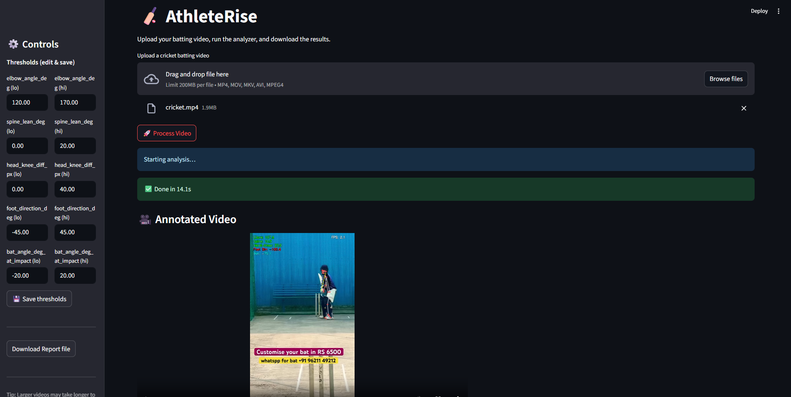

# AthleteRise – AI-Powered Cricket Analytics  
**Real-Time Cover Drive Analysis from Full Video**

<p align="center">
  
</p>

---

## 📌 Objective
AthleteRise is a Python-based system that processes a full cricket batting video in real time, performs pose estimation on each frame, calculates biomechanical metrics, and outputs:

- An **annotated video** with pose skeleton overlays and live metric readouts.
- A **final shot evaluation** with multi-category scores and actionable feedback.
- Optional performance charts and PDF reports.

---

## 🎯 Video to Analyze
Sample video used for testing:  
[YouTube Short](https://youtube.com/shorts/vSX3IRxGnNY)

---

## 🚀 Features

### **Base Scope**
1. **Full Video Processing (Real-Time Flow)**
   - Reads entire input video and processes all frames sequentially using OpenCV.
   - Supports FPS and resolution normalization while preserving near real-time flow.
   - Outputs a single annotated `.mp4` video.

2. **Pose Estimation (Per Frame)**
   - Uses MediaPipe or OpenPose to extract keypoints for head, shoulders, elbows, wrists, hips, knees, and ankles.
   - Handles missing joints gracefully.

3. **Biomechanical Metrics**
   - Front elbow angle (shoulder–elbow–wrist).
   - Spine lean (hip–shoulder line vs. vertical).
   - Head-over-knee alignment (vertical projected distance).
   - Front foot direction (toe/foot angle vs. crease or x-axis).

4. **Live Overlays**
   - Pose skeleton drawn on each frame.
   - Real-time metric readouts (e.g., “Elbow: 115°”).
   - Feedback cues when thresholds are breached.

5. **Final Shot Evaluation**
   - Computes a summary score (1–10) for:
     - Footwork
     - Head Position
     - Swing Control
     - Balance
     - Follow-through
   - Includes 1–2 lines of actionable feedback per category.
   - Saves summary to `evaluation.json`.

---
## ⚠️ Assumptions & Limitations
- Designed primarily for cricket **cover drives**; may require calibration for other shots.
- Performance depends on video quality, lighting, and camera angle.
- Occlusions or players blocking the batter can reduce detection accuracy.
- **Bat tracking** is not implemented in the base version.
- Does not include **automatic phase segmentation** (stance, stride, downswing, etc.).
- **Contact-moment detection** for bat-ball impact is not available.
- Processing speed depends on CPU/GPU capability; may not be real-time on slower machines.
- Angles and measurements are based on video frame coordinates; minor calibration errors may occur.
- Default `targets.json` thresholds may not fit all player techniques and require manual tuning.
- Designed for a single batter; multiple players in frame can cause incorrect tracking.
- Requires correct Python environment setup with dependencies from `requirements.txt`.

---
## 📂 Deliverables
- `cover_drive_analysis_realtime.py` – Main backend processing script.
- `main.py` - Main frontend processing script.
- `/output/` folder containing:
  - `annotated_video.mp4`
  - `evaluation.json`
  - Optional graphs & report files.
- `requirements.txt` – Python dependencies.
- `main.py` – Streamlit frontend app for uploading videos and viewing results.
- `README.md` – This documentation.

---

## ✅ Acceptance Criteria
- Processes the **entire video** and produces one annotated video.
- Per-frame pose overlays and at least three live metrics.
- Generates a **multi-category score + feedback** file.
- Handles missing detections without crashing.
- Clear setup and run instructions.

---

## ⭐ BONUS Features Implemented
- **Streamlit Mini-App**:  
  Upload a video → process it → view annotated playback → download JSON, graphs, and reports.
- **Config-based Thresholds**:  
  Editable `targets.json` file for metric thresholds.
- **Robustness**:  
  Auto-creation of `config/targets.json` with default keys to prevent KeyErrors.
- **Report Export**:  
  PDF report generation for summary metrics.

---

## 🛠️ Setup & Installation

### 1. Clone Repository
```bash
git clone https://github.com/Uvais5/AthleteRise.git
cd AthleteRise
```
### 2. Install Dependencies
```bash
pip install -r requirements.txt
```
### 3. Running the Project
```bash
streamlit run main.py
```
